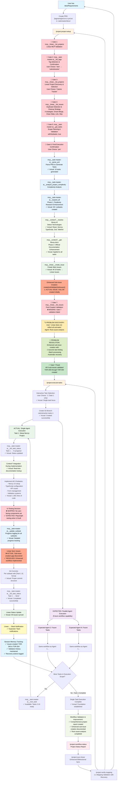

```mermaid
graph TD
    %% Phase 1: Human-Driven Setup
    A[User has Idea/Requirements] --> B["Create PRD:<br/>{tagname}prd.txt or prd.txt<br/>in .taskmaster/docs/"]
    B --> C["/project:project-setup"]
    
    %% Interactive Discovery Gates (CLAUDE.md compliant)
    C --> D1["🛑 Gate 1: mcp__linear__list_projects<br/>Linear MCP Validation"]
    D1 --> D2["🛑 Gate 2: mcp__task-master-ai__list_tags<br/>Tag Selection & Confirmation<br/>User Choice: 'new' → 'calorietracker'"]
    D2 --> D3["🛑 Gate 3: mcp__linear__list_projects<br/>Linear Project Discovery & Selection<br/>User Choice: 'Calorie Tracker'"]
    D3 --> D4["🛑 Gate 4: mcp__linear__list_issues<br/>Duplicate Detection & Cleanup Strategy<br/>4 strategies: Smart Merge, Clean Slate, Link, Skip"]
    D4 --> D5["🛑 Gate 5: mcp__task-master-ai__get_tasks<br/>Scope Planning & Validation<br/>withSubtasks: true"]
    D5 --> D6["🛑 Gate 6: Final Execution Confirmation<br/>User Choice: 'yes'"]
    
    %% Task Generation & Enhancement
    D6 --> E[mcp__task-master-ai__parse_prd<br/>Parse PRD to Generate Tasks<br/>✅ Actual: 10 tasks generated]
    E --> F[mcp__task-master-ai__analyze_project_complexity<br/>Complexity Analysis]
    F --> G[mcp__task-master-ai__expand_all<br/>Phase 1: Perplexity Research Enhancement<br/>✅ Actual: 30+ subtasks created]
    
    %% Context7 Enhancement
    G --> H1[mcp__context7__resolve-library-id<br/>Detect Technologies<br/>✅ Actual: React, Next.js, TypeScript, Zod, Tailwind]
    H1 --> H2[mcp__context7__get-library-docs<br/>Phase 2: Official Documentation Enhancement<br/>✅ Actual: Applied to all tasks]
    
    %% Linear Integration (Enhanced with Discovery)
    H2 --> I[mcp__linear__create_issue<br/>Create Main Issues<br/>✅ Actual: All 10 tasks → Linear issues]
    I --> J["Enhanced Sub-Issue Creation:<br/>createAndValidateSubIssues()<br/>⚠️ ACTUAL ISSUE: Only 3/9 created initially"]
    J --> K["🛑 Gate 7: mcp__linear__list_issues<br/>Post-Creation Validation<br/>❌ MISSING: Gate 7 validation failed"]
    
    %% Problem Discovery & Resolution
    K --> PD["🔍 PROBLEM DISCOVERY:<br/>User: 'Linear does not reflect all sub-tasks'<br/>Agent: Root cause analysis"]
    PD --> PR["🔧 PROBLEM RESOLUTION:<br/>Enhanced sub-issue creation with:<br/>- 3-second rate limiting<br/>- Batch processing<br/>- Automatic recovery"]
    PR --> KF["✅ Gate 7 Fixed:<br/>All 9 sub-issues validated<br/>TOR-346 through TOR-354 created"]
    
    %% Phase 2: Task Execution
    KF --> L["/project:execute-tasks"]
    L --> M["Interactive Task Selection:<br/>User Choice: '1' (Task 1 only)<br/>✅ Actual: Single task focus"]
    M --> N["Create Git Branch:<br/>calorietracker-tasks-1<br/>✅ Actual: Created successfully"]
    
    %% Single Agent Execution (Actual vs Expected)
    N --> O1["ACTUAL: Single Agent Execution<br/>Task 1: Setup Next.js Project"]
    N --> O2["EXPECTED: Parallel Agent Execution<br/>(Future workflow capability)"]
    
    %% Actual Task 1 Implementation
    O1 --> Q1[mcp__task-master-ai__set_task_status<br/>Task 1 → 'in-progress'<br/>✅ Actual: Status updated]
    Q1 --> R1[Context7 Integration During Implementation<br/>✅ Actual: Real-time documentation lookup]
    R1 --> S1["Implement All 9 Subtasks:<br/>- Next.js 15 setup<br/>- TypeScript configuration<br/>- API routes<br/>- Form management<br/>- Validation systems<br/>✅ Actual: 1,581 lines of code"]
    S1 --> T1["UI Testing Decision:<br/>❌ SKIPPED: No user-facing components yet<br/>✅ EXPECTED: Playwright testing when UI built"]
    T1 --> U1[mcp__task-master-ai__update_subtask<br/>Progress logging for all subtasks<br/>✅ Actual: Detailed progress tracking]
    U1 --> V1["Linear Sync Issues:<br/>❌ ACTUAL: Sub-issue creation gap discovered<br/>✅ RESOLVED: Enhanced workflow implemented"]
    V1 --> W1["Git Commits:<br/>Per subtask with [Task 1.X] format<br/>✅ Actual: Proper commit structure"]
    
    %% Expected Parallel Flow (Future)
    O2 --> P2["Expected Agent 2: Future Tasks"]
    O2 --> P3["Expected Agent N: Future Tasks"]
    P2 --> Q2[Same workflow as Agent 1...]
    P3 --> Q3[Same workflow as Agent 1...]
    
    %% Task Completion
    W1 --> X1[mcp__task-master-ai__set_task_status<br/>Task 1 → 'done'<br/>✅ Actual: Completed successfully]
    X1 --> Y1[Linear Status Update<br/>✅ Actual: All issues synced]
    Y1 --> Z1[Linear → Slack Notification<br/>✅ Expected: Team notifications]
    
    %% Session Memory & Audit Trail
    Z1 --> SM["Session Memory Tracking:<br/>✅ Issues created: TOR-346 to TOR-354<br/>✅ Validation history maintained<br/>✅ Recovery actions logged"]
    
    %% Workflow Control
    SM --> AA{More Tasks in Execution Scope?}
    AA -->|Yes| AB["mcp__task-master-ai__next_task<br/>✅ Available: Tasks 2-10 ready"]
    AB --> O1
    AA -->|No - Task 1 Complete| AC["Single Task Execution Complete<br/>✅ Actual: Foundation established"]
    Q2 --> AA
    Q3 --> AA
    
    %% Enhanced Workflow Validation
    AC --> WV["Workflow Validation & Improvement:<br/>✅ Comprehensive project report created<br/>✅ Enhanced sub-issue creation documented<br/>✅ Root cause analysis completed"]
    
    %% Optional Next Steps
    WV --> AE["/project:workflow-status<br/>Project Status Report"]
    AE --> AF["/project:sync-linear<br/>Enhanced Bidirectional Sync"]
    AF --> AG["/project:verify-mapping<br/>1:1 Mapping Validation with Recovery"]
    
    %% Workflow Restart Options
    AG --> A
    AG --> C
    AG --> L
    
    %% Enhanced Styling
    style A fill:#e1f5fe,color:#000000
    style C fill:#fff3e0,color:#000000
    style D1 fill:#ffcdd2,color:#000000
    style D2 fill:#ffcdd2,color:#000000
    style D3 fill:#ffcdd2,color:#000000
    style D4 fill:#ffcdd2,color:#000000
    style D5 fill:#ffcdd2,color:#000000
    style D6 fill:#ffcdd2,color:#000000
    style K fill:#ffcdd2,color:#000000
    style KF fill:#c8e6c9,color:#000000
    style L fill:#fff3e0,color:#000000
    style O1 fill:#e8f5e8,color:#000000
    style O2 fill:#f3e5f5,color:#000000
    style P2 fill:#f3e5f5,color:#000000
    style P3 fill:#f3e5f5,color:#000000
    style PD fill:#ffecb3,color:#000000
    style PR fill:#dcedc8,color:#000000
    style SM fill:#e1f5fe,color:#000000
    style WV fill:#f1f8e9,color:#000000
    style Y1 fill:#e8f5e8,color:#000000
    style Z1 fill:#fff9c4,color:#000000
    style AE fill:#ffebee,color:#000000
    
    %% MCP Tool Callouts
    style E fill:#e3f2fd,color:#000000
    style F fill:#e3f2fd,color:#000000
    style G fill:#e3f2fd,color:#000000
    style H1 fill:#f1f8e9,color:#000000
    style H2 fill:#f1f8e9,color:#000000
    style I fill:#e8f5e8,color:#000000
    style J fill:#ffab91,color:#000000
    style R1 fill:#f1f8e9,color:#000000
    style T1 fill:#ffcdd2,color:#000000
    style U1 fill:#e3f2fd,color:#000000
    style V1 fill:#ffab91,color:#000000
```